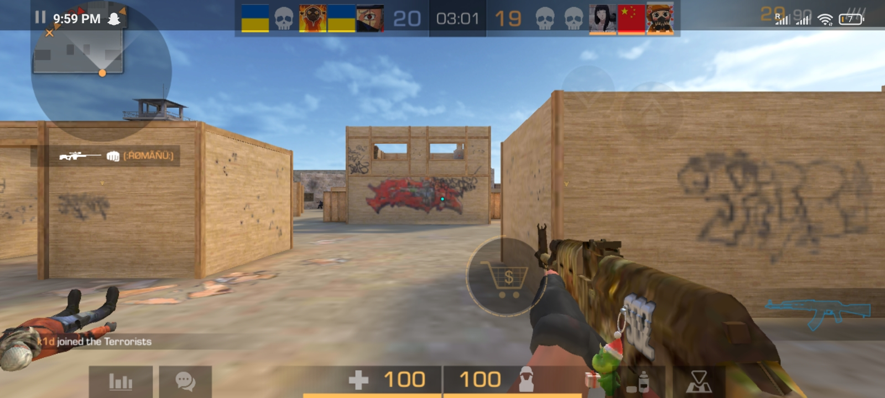

# <span class="bright"> Heading 1 </span>
## Heading 2
### Heading 3
#### Heading 4
##### Heading 5
###### Heading 6

 A <span class="bright"> line </span> of text lorem ispums reco gecko

 A paragraph of text, well this is kind of awkard
 i don't really know what to write to be honest;
 well in a sense the act of now writting makes
 you write, while writting makes you not write
 if you know what i mean. well in a sense the act of now writting makes
 you write, while writting makes you not write
 if you know what i mean.
 well in a sense the act of now writting makes
 well in a sense the act of now writting makes
 well in a sense the act of now writting makes
 you write, while writting makes you not write
 if you know what i mean.
 you write, while writting makes you not write
 if you know what i mean.
 you write, while writting makes you not write
 if you know what i mean.

 - list of
 - unorders
    - what is this
    - whah
 - shits

 1. list of
 2. ordered
    1. what
    2. ee
 3. shits

 ___
 <fake@email.com>

 _something_italic_
 **something_blod**

        var this = code
        fn void main() {
                return 0
        }

```
        var this = also_code
        fn void main() {
                return 0
        }
```


 | a         | table | i  | think  |
 |-----------|-------|----|--------|
 | hopefully | data  | is | gettng |
 | There     |       |    |        |


[link_to_somethgin](https://xhamster.com)


> quoteing something. <br/>
> i need these quotus to work. <br/>
> I neeedssss to <br/>

<input />
<button>click me</button>
